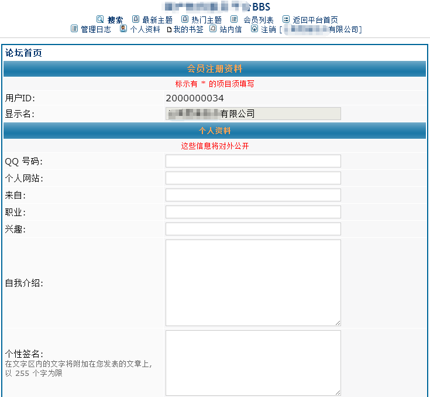

[TOC]

## jforum二次开发相关笔记
### 1. 引言

[jforum](http://jforum.net)是Rafael Steil开发的一个基于JAVA的开源论坛，采用BSD开源协议，可以最大限度的进行任何修改和扩展，包括商业用途。它提供了诸如SSO之类的抽象接口，具有完全的权限控制、支持包括中文在内的十几种语言、可自定义的用户接口、安全、多数据库支持等特性。JForum 采用 FreeMarker作为页面模板引擎。jforum的介绍这里不再敷述，因项目需要，需要对jforum进行修改、实现从CS平台登录以后单点登录到jforum，因为jforum只支持唯一用户名标识，所以还需对jforum进行二次开发。(注：本文的jforum版本为2.1.9。)

### 2. jforum的页面请求机制
将jforum导入到eclipse可以参考《[Java开源论坛JForum二次开发技术资料之导入安装](http://www.jiacode.com/739.html)》。以最简单的在一个登陆用户进入 `个人资料`页为例：


#### 2.1 处理url
用户点击 `个人资料`，页面请求的url为/user/edit/session中获取的用户Id如header.htm源码所示：
`/jforum/WebContent/templates/default/header.htm`

```jsp
<a id="myprofile" class="mainmenu" href="${JForumContext.encodeURL("/user/edit/${session.userId}")}">

${I18n.getMessage("ForumBase.profile")}
```

JForum中的JForumContext.encodeURL方法（注：实现在/jforum/src/net/jforum/context/JForumContext.java下）根据请求的url中的 user`和 edit`在modulesMapping.properties中查询user对应的配置项:

`/jforum/WebContent/WEB-INF/config/modulesMapping.properties`

```java
user=net.jforum.view.forum.UserAction
```

#### 2.2 查询action
根据请求的url中的 edit`在相应的UserAction中找到edit方法：

`/jforum/src/net/jforum/view/forum/UserAction.java`

```java
public void edit() {
	if (this.canEdit()) {
		int userId = this.request.getIntParameter("user_id");
		UserDAO um = DataAccessDriver.getInstance().newUserDAO();
		User u = um.selectById(userId);
		this.context.put("u", u);
		this.context.put("action", "editSave");
		this.context.put("pageTitle", I18n.getMessage("UserProfile.profileFor") + " " +u.getUsername());
		this.context.put("avatarAllowExternalUrl", SystemGlobals.getBoolValue(ConfigKeys.AVATAR_ALLOW_EXTERNAL_URL));
		this.setTemplateName(TemplateKeys.USER_EDIT);
	}
}
```

#### 2.3 查询dao层
根据action中的 um.selectById(userId)`请求UserDAO文件中的selectById方法：

`/jforum/src/net/jforum/dao/UserDAO.java`

```java
/**
* Gets a specific <code>User</code>.
*
* @param userId The User ID to search
* @return <code>User</code>object containing all the information
* @see #selectAll
*/
public User selectById(int userId) ;
```

UserDAO只是一个抽象的DAO接口，GenericUserDAO具体实现了UserDAO中定义的方法：

`/jforum/src/net/jforum/dao/generic/GenericUserDAO.java`

```java
/**
* @see net.jforum.dao.UserDAO#selectById(int)
*/
public User selectById(int userId)
{
	String q = SystemGlobals.getSql("UserModel.selectById");
	PreparedStatement p = null;
	ResultSet rs = null;
	try {
		p = JForumExecutionContext.getConnection().prepareStatement(q);
		p.setInt(1, userId);
		rs = p.executeQuery();
		User u = new User();
		if (rs.next()) {
			this.fillUserFromResultSet(u, rs);
			u.setPrivateMessagesCount(rs.getInt("private_messages"));
			rs.close();
			p.close();
			// User groups
			p = JForumExecutionContext.getConnection().prepareStatement(SystemGlobals.getSql("UserModelselectGroups"));
			p.setInt(1, userId);
			rs = p.executeQuery();
			while (rs.next()) {
				Group g = new Group();
				g.setName(rs.getString("group_name"));
				g.setId(rs.getInt("group_id"));
				u.getGroupsList().add(g);
			}
		}
		return u;
	}
	catch (SQLException e) {
		throw new DatabaseException(e);
	}
	finally {
		DbUtils.close(rs, p);
	}
}
```
#### 2.4 查询sql
根据GenericUserDAO文件中的 UserModel.selectById`查询sql文件中相应的sql：

`/jforum/WebContent/WEB-INF/config/database/generic/generic_queries.sql`

```sql
UserModel.selectById = SELECT COUNT(pm.privmsgs_to_userid) AS private_messages, u.* \
FROM jforum_users u \
LEFT JOIN jforum_privmsgs pm ON pm.privmsgs_type = 1 AND pm.privmsgs_to_userid = u.user_id \
WHERE u.user_id = ? \
GROUP BY pm.privmsgs_to_userid
```
#### 2.5 返回结果到页面
根据 `templatesMapping`中的配置找到user.edit对应的页面
`/jforum/WebContent/WEB-INF/config/templatesMapping.properties`

```java
user.edit = user_form.htm
```
#### 2.6 打印页面
在页面中填入查询到的值：

`/jforum/WebContent/templates/default/user_form.htm`

```html
<span class="gen">
<#if admin?default(false)>
<input class="post" type="text" name="username"  value="${u.username?html}" />
<#else>
${u.username?html}
</#if>
</span>
```

用户的实体类在 `/jforum/src/net/jforum/entities/User.java` 下。
个人资料页如下图所示:



### 3. 参考资料

* [Java开源论坛JForum二次开发技术资料之导入安装](http://www.jiacode.com/739.html)