[TOC]

## 背景

一个亲戚是RP患者（Retinitis Pigmentosa 视网膜色素变性），视力越来越很差，差到什么程度呢？用她自己话就是在大白天也像在月光下一样。我平常就会关注一些可以让他方便、让他高兴的东西，比如上次看了@airliuxi写的《好声音，随心听：HIMALAYA 喜马拉雅 好声音听书宝》，就买了一个听书宝。虽然可以通过语音点播喜马拉雅的音频读物和天天动听的歌曲，但是点播形式单一，识别率低，而且音频读物没有记忆功能，下次听书还是从第一集开始。然后他最近去参加了初中同学的30年聚会，然后迷上了微信，天天拉着我姐帮她用微信和初中同学聊天。后来刚好在淘宝发现有盲人读屏系统，又刚好看了@lsxnano的《#本站首晒## 千元机玩转4GB RAM：奇虎360 N4 32GB 移动4G 智能手机》，觉得还不错，就在京东买了一台360 N4，然后把旧的魅蓝note1寄给去装盲人读屏系统，先测试一下这个盲人系统。

## 盲人系统

购买链接https://item.taobao.com/item.htm?id=523214035677
这个盲人系统主要是在已有手机的系统上安装了盲人桌面、语音播报、和一些其他适合盲人使用的应用。
http://v.qq.com/boke/page/e/0/a/e01652jr5fa.html

### 基本介绍

盲人桌面是把手机的基本电话、信息、联系人、通话记录等基本功能重新设计，除了增大字体，还把一些加大了图标。
语音播报就是结合盲人桌面，可以根据手势按照一定的顺序播报所选中的内容，比如下图会播报日期时间、各个图标

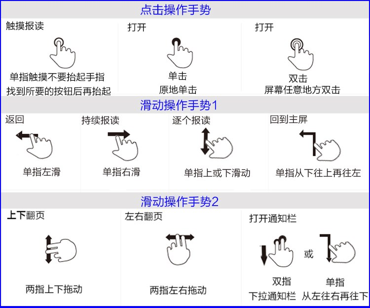

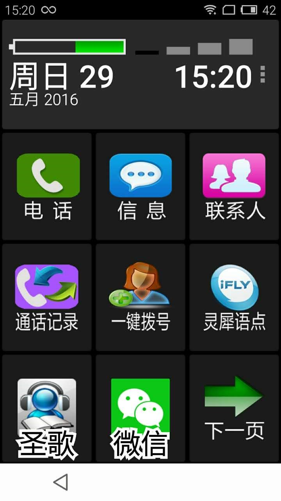

### 语音助理

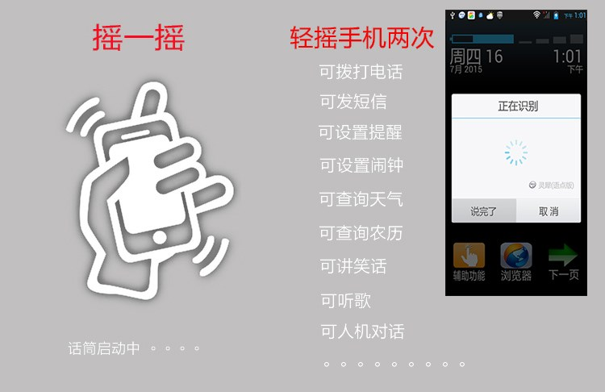

拨打电话13712341234比输入方便
调用的是讯飞语记或者叫灵犀，感觉还是挺智能

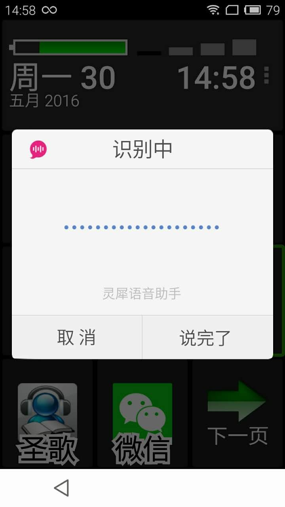

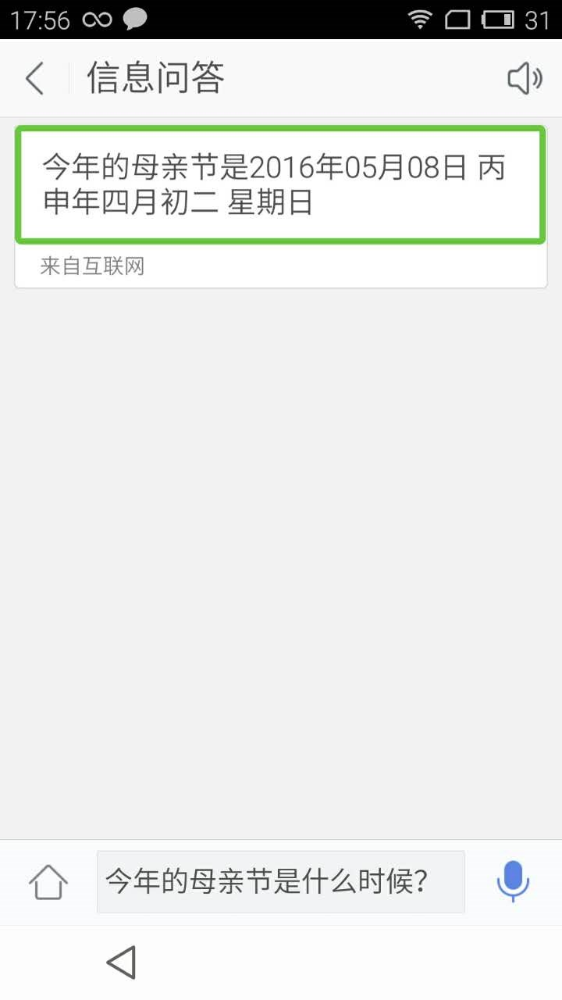

### 微信

使用过程中，一个难点是，如何引导他理解手机的主屏、应用、微信聊天列表、微信聊天窗口、微信聊天记录、这都需要他理解的基础上，才能”无障碍“的使用这个应用，
一些TIPS：把常用的联系人固定在聊天列表中 如果遇到什么问题 可以多用返回手势（单指左滑←）只到回到主屏，相当于初始化，底栏“微信”“通讯录”“发现”“我”中切换 ，需要他根据播报的内容确定所在位置，上下滑动和左右滑动，希望他不要太晕。。。毕竟微信不像盲人桌面中的应用，是针对盲人做过图标简化、内容提示及流程的优化的。

### 阅读

#### 读读日报

这里推荐知乎的读读日报app，里面有一个日报叫做《给爸妈看点儿靠谱的》，想想别人家妈妈的会给孩子发鸡汤，到我这边就反过来了哈哈哈。

#### 本地图书

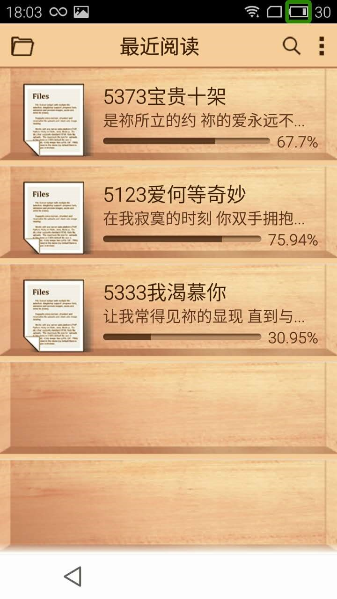

#### 喜马拉雅听书

### 其他

#### 无线充电

链接http://s.click.taobao.com/hgmgSXx

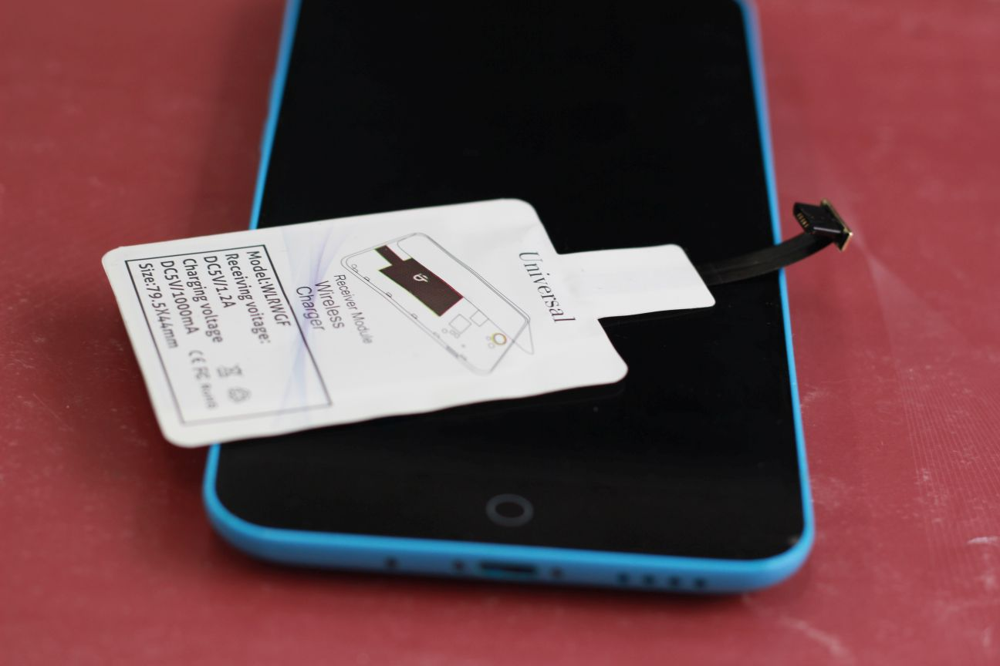
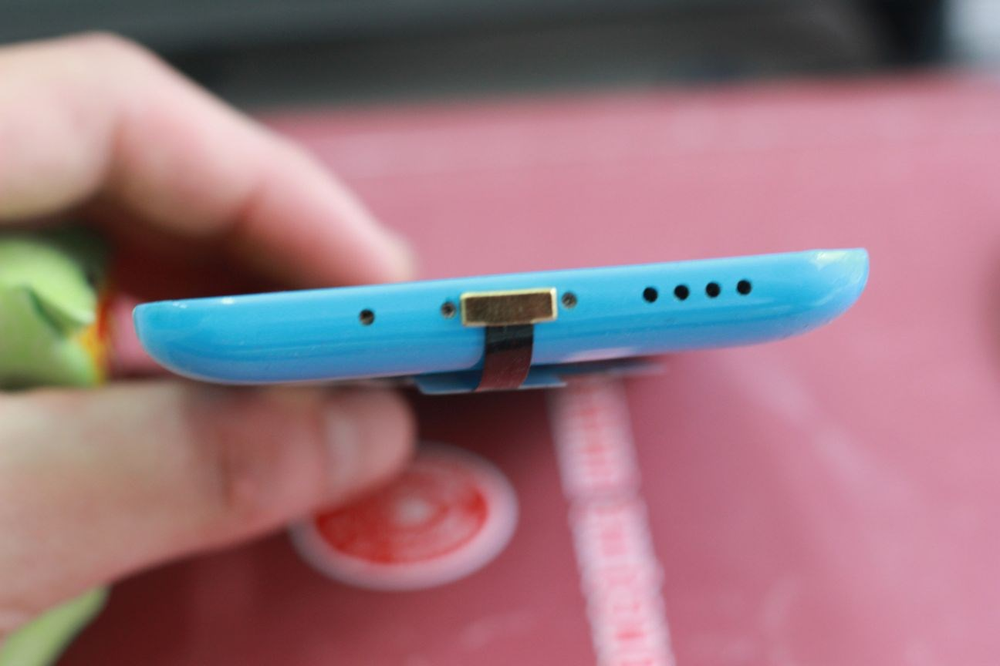
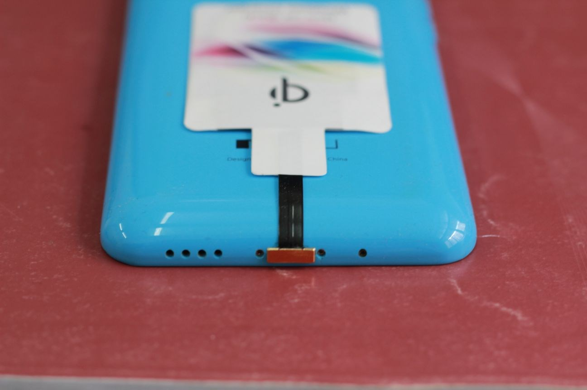
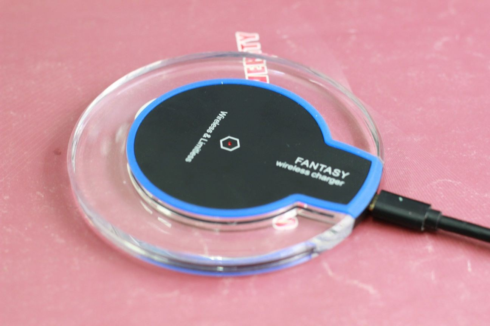
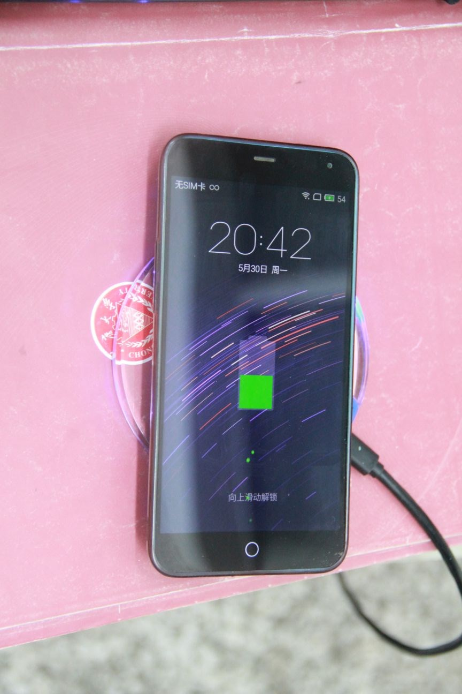

> 目前主流的无线充电标准有三种：Power Matters Alliance（PMA）标准、Qi标准、Alliance for Wireless Power（A4WP）标准。 Qi是全球首个推动无线充电技术的标准化组织——无线充电联盟（Wireless Power Consortium，简称WPC）推出的“无线充电”标准，具备便捷性和通用性两大特征。首先，不同品牌的产品，只要有一个Qi的标识，都可以用Qi无线充电器充电。其次，它攻克了无线充电“通用性”的技术瓶颈，在不久的将来，手机、相机、电脑等产品都可以用Qi无线充电器充电，为无线充电的大规模应用提供可能。目前，市场比较主流的无线充电技术主要通过三种方式，即电磁感应、无线电波、以及共振作用，而Qi采用了目前最为主流的电磁感应技术。在技术应用方面，中国公司已经站在了无线充电行业的最前沿。据悉，目前Qi在中国的应用产品主要是手机，这是第一个阶段，以后将发展运用到不同类别或更高功率的数码产品中。截至目前，联盟成员数量已增加到74家，包括飞利浦、HTC、诺基亚、三星、索尼爱立信、百思买等知名企业都已是联盟的成员。

## 总结和展望

这个系统优缺点：

* 优
  * 让他跟我聊上微信了，以下确定可以省略
* 缺
  * 语音音量太小（技术人员称为知错误）
  * 读屏软件淘宝服务一般，出现上面出面提到的音量问题无法解决，居然没人跟我联系，让我白白等了一周，期间还骗我说发货了。
  * 无线充电接触面有点小，需要对准才能充电

### 近期展望

等他熟悉这个系统以后，需要用一台实体HOME键+电信手机+原生无线充电+华为（或者360等）带系统远程控制的手机、如果以后能Android能学习苹果，加入force touch的功能，盲人系统在这基础上进行升级，改为轻触读屏，重压点击的模式，操作性会提升很多。
### 远期展望
谷歌的android智能机的革命和苹果的siri又引起的语音识别的热潮，希望以后受到了谷歌眼镜的启发，AR眼镜能够发展得起来，然后加上最近很好的机器学习，能够识别图片的内容，我希望有那么一天，我妈带着XX眼镜，然后我给她发了一张照片，然后系统识别出照片里面有谁、在什么地方、干什么。

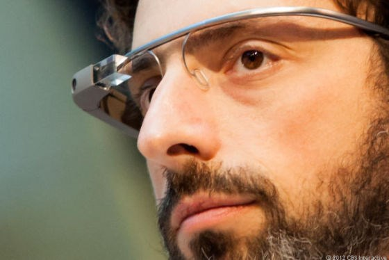

## 扩展阅读

* [无线充电技术的三大主流标准：PLA、Qi和A4WP](http://www.leiphone.com/news/201406/1114-zzl-pla-qi-a4wp.html)》
* 《[虚拟现实与增强现实（眼镜或头盔）的现状与未来－简介](http://blog.csdn.net/yanzhanyi/article/details/41982033)》
* 《[谷歌机器学习进展：让电脑一句话描述图片内容](http://tech.sina.com.cn/i/2014-11-19/doc-icczmvun0057362.shtml)》
* 《[Google 眼鏡我的開箱心得：那些 Google Glass 真實生活功能](http://www.playpcesor.com/2014/04/google-google-glass.html)》